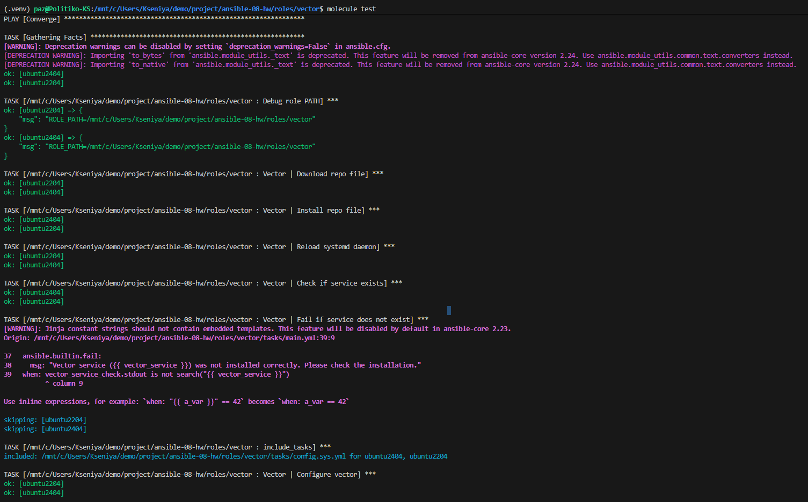
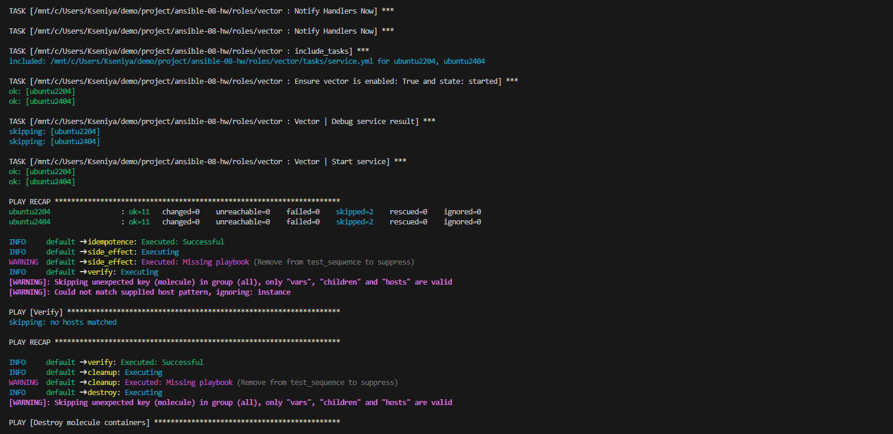
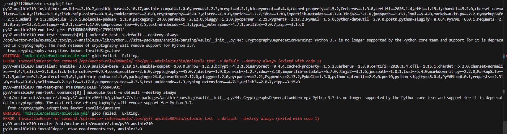
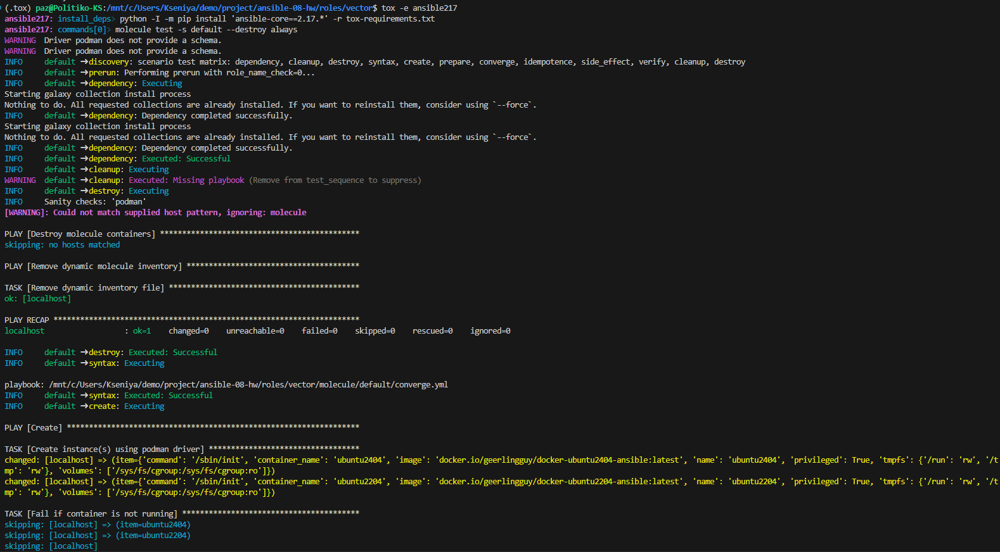
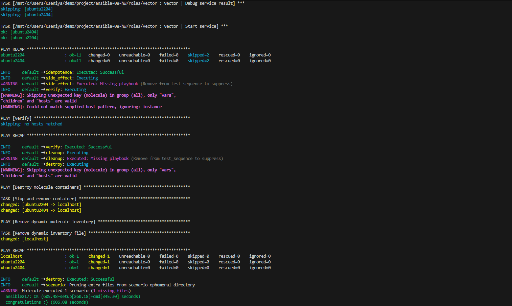

# Домашнее задание к занятию 5 «Тестирование roles»

## Подготовка к выполнению

1. Установите molecule и его драйвера: `pip3 install "molecule molecule_docker molecule_podman`.
2. Выполните `docker pull aragast/netology:latest` —  это образ с podman, tox и несколькими пайтонами (3.7 и 3.9) внутри.

## Основная часть

Ваша цель — настроить тестирование ваших ролей. 

Задача — сделать сценарии тестирования для vector. 

Ожидаемый результат — все сценарии успешно проходят тестирование ролей.

### Molecule

1. Запустите  `molecule test -s ubuntu_xenial` (или с любым другим сценарием, не имеет значения) внутри корневой директории clickhouse-role, посмотрите на вывод команды. Данная команда может отработать с ошибками или не отработать вовсе, это нормально. Наша цель - посмотреть как другие в реальном мире используют молекулу И из чего может состоять сценарий тестирования.
2. Перейдите в каталог с ролью vector-role и создайте сценарий тестирования по умолчанию при помощи `molecule init scenario --driver-name docker`.
3. Добавьте несколько разных дистрибутивов (oraclelinux:8, ubuntu:latest) для инстансов и протестируйте роль, исправьте найденные ошибки, если они есть.
4. Добавьте несколько assert в verify.yml-файл для  проверки работоспособности vector-role (проверка, что конфиг валидный, проверка успешности запуска и др.). 
5. Запустите тестирование роли повторно и проверьте, что оно прошло успешно.
5. Добавьте новый тег на коммит с рабочим сценарием в соответствии с семантическим версионированием.

### Tox

1. Добавьте в директорию с vector-role файлы из [директории](./example).
2. Запустите `docker run --privileged=True -v <path_to_repo>:/opt/vector-role -w /opt/vector-role -it aragast/netology:latest /bin/bash`, где path_to_repo — путь до корня репозитория с vector-role на вашей файловой системе.
3. Внутри контейнера выполните команду `tox`, посмотрите на вывод.
5. Создайте облегчённый сценарий для `molecule` с драйвером `molecule_podman`. Проверьте его на исполнимость.
6. Пропишите правильную команду в `tox.ini`, чтобы запускался облегчённый сценарий.
8. Запустите команду `tox`. Убедитесь, что всё отработало успешно.
9. Добавьте новый тег на коммит с рабочим сценарием в соответствии с семантическим версионированием.

После выполнения у вас должно получится два сценария molecule и один tox.ini файл в репозитории. Не забудьте указать в ответе теги решений Tox и Molecule заданий. В качестве решения пришлите ссылку на  ваш репозиторий и скриншоты этапов выполнения задания. 

## Необязательная часть

1. Проделайте схожие манипуляции для создания роли LightHouse.
2. Создайте сценарий внутри любой из своих ролей, который умеет поднимать весь стек при помощи всех ролей.
3. Убедитесь в работоспособности своего стека. Создайте отдельный verify.yml, который будет проверять работоспособность интеграции всех инструментов между ними.
4. Выложите свои roles в репозитории.

В качестве решения пришлите ссылки и скриншоты этапов выполнения задания.

---

### Как оформить решение задания

Выполненное домашнее задание пришлите в виде ссылки на .md-файл в вашем репозитории.


# Решение

Роль **vector** лежит тут: [vector](https://github.com/Arthur-Politiko/vector-ansible-role/blob/main/README.md)


## Подготовка к выполнению

Создаём в Python окружение и скаиваем в него требуемые библиотеки:
```bash
python3 -m venv .venv
source .venv/bin/activate
```
тянем образ с podman, tox и несколькими пайтонами (3.7 и 3.9) внутри.
```bash
docker pull aragast/netology:latest
```

вытягиваем ранее созданные роли:
```bash
ansible-galaxy install -r requirements.yml -p roles/
```

### Задание Molecule

1. 
Заходим в `roles/clickhouse` и запускаем 
```bash
molecule test -s ubuntu_xenial
```
и получаем `Адъ`, так как это всё было настроено под старую версию molecule да и у нас отсутствует rsync на хосте.

Но, нас об этом предупреждали и мы двигаемся далее

2. 
Заходим в `roles/vector` и запускаем
```bash
molecule init scenario --driver-name docker
```
но, ничего не получаем, так как данная версия `molecule` не понимает `--driver-name`

Согласно официальному [FAQ](https://docs.ansible.com/projects/molecule/getting-started-playbooks/) мы должны запустить инициализацию сценария вот таким способом:
```bash
# Default container testing scenario
molecule init scenario default
```
после чего у нас появится каталог `molecule/default` содержащий все необходимые файлы.

К сожалению, в Molecule 25.x поэтому версии для драйвера docker у нас не получится и часть кода прийдётся писать руками.

3. 
Стоит добавить `requirements.yml` чтобы Molecule/Ansible автоматически подтягивал зависимости. Так как мы используем `containers.podman.podman_container` нам нужен модуль из `containers.podman`, вот его и укажем:

```yaml
---
collections:
  - name: containers.podman
  - name: community.docker
```

Нам требуется добавить несколько разных весий дистрибутивов (oraclelinux:8, ubuntu:latest) для инстансов и протестировать роль.
Для этого в файл [molecule.yml](./roles/vector/molecule/default/molecule.yml) добавляем секции `driver:` и `platforms:`.
Далее, комментируем в секции `ansible:` аргументы **inventory** для `ansible_playbook`, из секции `playbooks:` лишние плейбуки, тоже проделываем с секцией `scenario:`.

Стоит отдельно скаазать, что пример работы с docker instance лучше взять в официальной [документации](https://docs.ansible.com/projects/molecule/examples/docker/)

Обязательной проверкой на данном этапе является запуск отдельных сценариев, а именно `create` и `destroy`:

```bash
molecule destroy -s default
molecule list -s default
molecule create -s default
molecule destroy -s default
```

Этап `create` должен происходить без "массового" **SKIPED**

Запуск полного тестирования:
```bash
molecule test
```
Если нужно проверить работу без удаления контейнеров, то можно использовать следующую команду:
```bash
molecule test --destroy=never
```

Результаты прогона `smoke` теста:
```bash
molecule test -s default
```



### Задание Tox

Tox - это оркестратор тестов. Официальная документация: https://tox.wiki/en/latest/

Скачиваем папку **tree/MNT-video/08-ansible-05-testing/example** из репозитория `https://github.com/netology-code/mnt-homeworks/` 

Запускаем `docker run --privileged=True -v <path_to_repo>:/opt/vector-role -w /opt/vector-role -it aragast/netology:latest /bin/bash`

Оказываясь внутри контейнера заходим в каталог example и запускаем `tox`
И... получаем кучу ошибок из-за сторых версий **python** в конфиге `tox`


Пара слов про tox. Во-первых, эта штука позволяет прогонять на разных `матрицах` окружения, будь то матрица по `Ansible`, `Docker`, `Python` итп. В зависимости от потребности. В задании стоит требование прогнать по разным весриям `python` что несовсем понятно, у нас же роль, а в ней мы используем ansible. Нам же не ansible тестировать, а роль, поэтому ИМХО было бы целесообразнее указать несколько версий ansible-core (2.16, 2.17, 2.18)

Во-вторых, у нас роль поднимает в `molecule` контейнер на `podman` и поднимать `podman` в `docker` звучит не очень. Плюс у меня это всё крутится в виртуалке `WSL`, получается та ещё матрёшка (nested containers про которые нам рассказывали, что это зло!). Почему бы на хосте не использовать разные environment для разных версий тестов и `python`? Нет, я понимаю про повторяемое окружение, но у нас же есть `pyenv`, и единый `requirements.txt` который позволяет использовать фиксированное окружение!

Я запускаю этот тест, и получаю повисание на несколько часов (серьёзно, час прождал, оно так и не разродилось) 


Если говорить откровенно, то я бы предпочёл иную схему, для теста строго `smoke` тесты, которые проверяют, что роль работает как надо не на локальном docker хосте, а на **УДАЛЁННОМ** host сервере. Или выносить `tox` из `docker` контейнера и запускать его на хосте.

В задаче у нас используется image `aragast/netology:latest`, который уже содержит `tox` но он так же содержит очень старую версию python3.6.

В общем. Попробуем реализовать запуск molecule в tox. 
Для этого нам понадобится чистое окружение для tox.
Заодно обновим pip.
```bash
python3 -m venv .tox
source .tox/bin/activate
pip install -U pip
pip install tox
tox --version
```

Так как используем свежий `tox` изменим `tox-requirements.txt`
вместо `molecule_podman` (старый вариант) напишем `molecule-plugins[podman]` и изменим `tox.ini`.

Небольшой ЛикБез по **base options** [тут подробнее](https://tox.wiki/en/latest/config.html#conf-testenv)

`skipsdist = true`- Flag indicating to perform the packaging operation or not. Set it to true when using tox for an application, instead of a library.
`passenv = * `    - Environment variables to pass on to the tox environment.
`setenv = ...`    - Environment variables to set in the tox environment.
`deps = ...`      - Dependencies to install in the tox environment.
`commands = ...`  - Commands to run in the tox environment.
`toxinidir = ...` - The root directory for the tox project (where the configuration file is found).

В `[testenv]` настраиваем общее окружение для теста. В нём прописываем зависимости, настраиваем окружение, и команду для запуска теста.

Важно. В `deps = ...` мы делаем **магию** с установкой разных версия ansible объявляя зависимость которая берётся из `env:ANSIBLE_CORE_VERSION`. По-моему, просто здорово.

Далее в `setenv = ...` мы пишем `ANSIBLE_ROLES_PATH={toxinidir}/..:{env:ANSIBLE_ROLES_PATH:}` для того, чтобы указать путь к ролям (можно было бы и захардкодить или вообще не указывать, но велика вероятность, что за ролью tox/molecule полезет в ~/.ansible/roles/...)

Далее вместо `passenv = *` пишем `passenv = HOME, PATH...`, это мининмум чтобы работал **podman**.


Такой `[testenv]` позволяет нам описывать сами тесты в таком виде:
```ini
[testenv:ansible216]
setenv =
    {[testenv]setenv}
    ANSIBLE_CORE_VERSION=2.16.*

```

вместо такого:
```ini
[testenv:ansible216]
deps =
  -r tox-requirements.txt
  ansible-core==2.16.*
commands = molecule test -s default --destroy always
```

Тут  `{[testenv]setenv}` говорит вставь всё из [testenv]->setenv
а `ANSIBLE_CORE_VERSION=2.16.*` переопределяет версию ansible которая будет использоваться в тесте.

Для теста заходим в каталог 'roles/vector' и запускаем команду 
```bash
tox -e ansible216
```
для прогона теста только для версии **ansible 2.16.**

и получаем примерно вот такой результат:



В общем, `tox` показался мне совершенно годной вещью. 